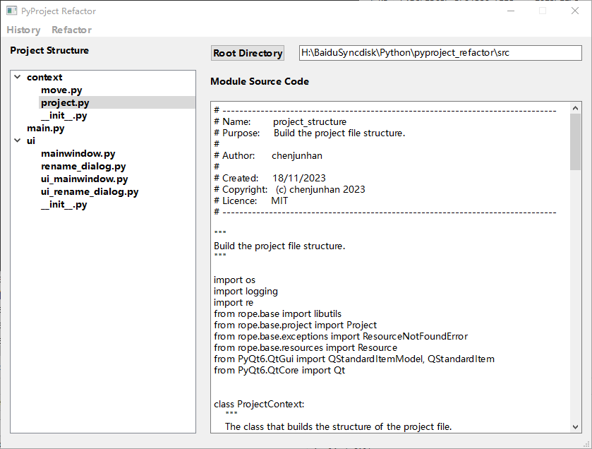
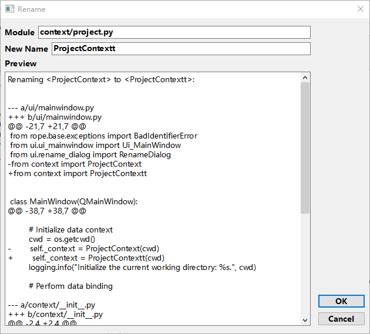

# Overview

This is a Python based GUI interface. It uses [PyQt6](https://pypi.org/project/PyQt6/), [rope](https://pypi.org/project/rope/), and standard libraries. The purpose is to provide refactoring capabilities when developing [Python](https://www.python.org/) projects.

The refactoring functionality is based on rope and the software provides a GUI interface to visualize the refactoring process, which is still under development.

# Feature

Refer to [rope doc](https://rope.readthedocs.io/en/latest/rope.html#) for the features implemented by the rope library, which this software intends to implement in line with it.

The rename feature has now been implemented.

# Software Interface

Below are the completed and tested features(interfaces) ,I have provided the `test` folder for you to test. 

## mainwindow

---

## rename

